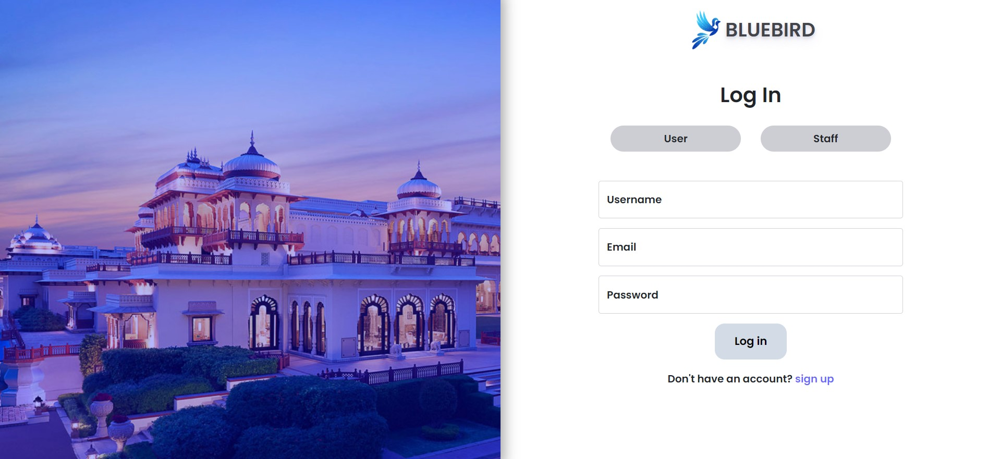
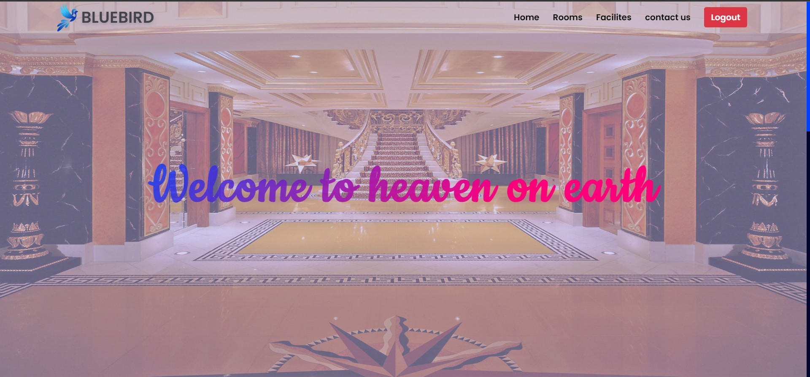
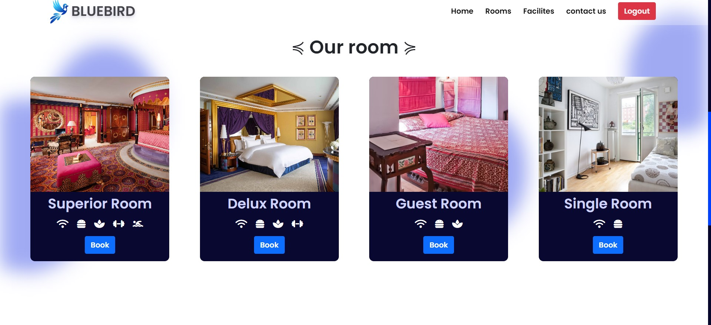
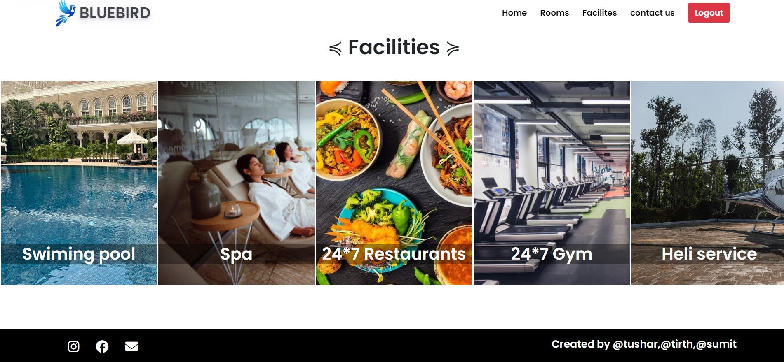
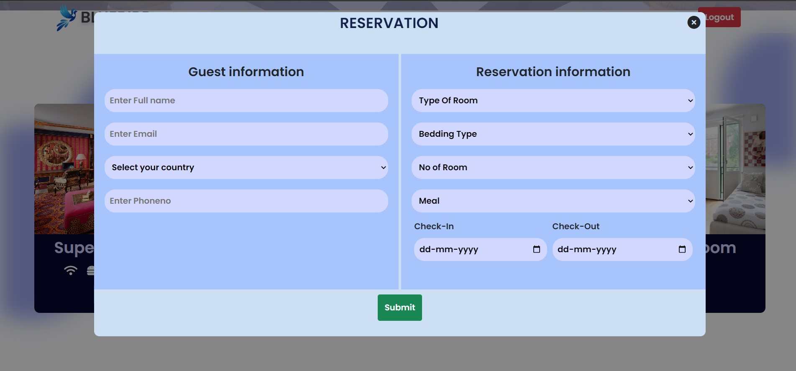
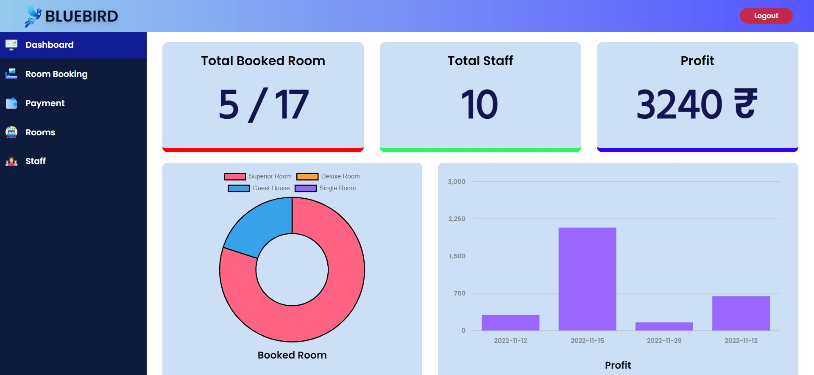
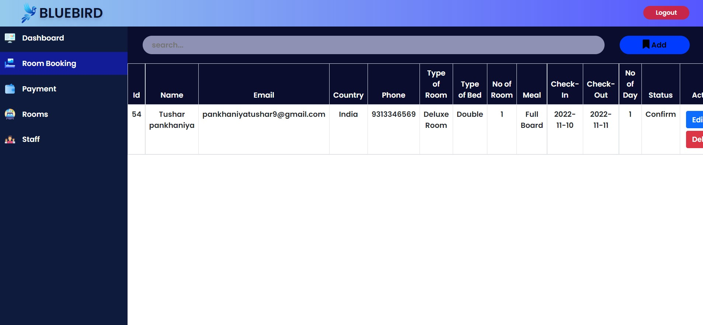
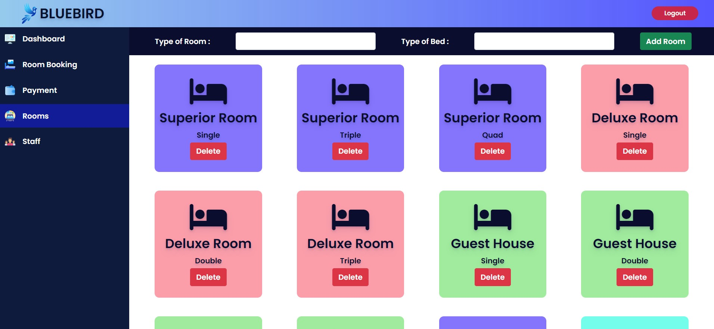

# hotel management system

Simple hotel booking website with content management system. Users can book rooms for specific date. Admin can create, update, delete a hotel and its rooms. Admin can manage everything in the app.

## Technology we used 

```sh
HTML
CSS
JAVASCRIPT
PHP
BOOTSTRAP 
```

## REQUIREMENTS:

```sh
1 Download & Install: XAMPP in C:\xampp (default)
2 Clone this repository in C:\xampp\htdocs
3 Run XAMPP and start "Apache" and "MySQL"
4 Open the link "localhost/phpmyadmin/"
5 Click on new at sidebar and create a database name "bluebirdhotel"
After clicking database click import and select the file "bluebirdhotel.sql"
Open the link "localhost/hotel_management_system/"
Now register and login
``

## Screenshot of hotel management system

### login page

```sh
== Staff Login ==
Email : Admin@gmail.com
Password : 1234
```
<p align="center">

</p>
      
## home page
<p align="center">
      
      
      
      
</p>

## Admin panel include dashboard 
<p align="center">
      
      
      
      
</p>


